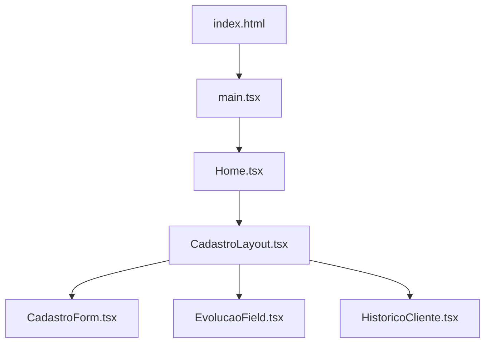

# 📋 Visão Geral do Projeto — Fisio

> **Sistema de Cadastro para Clínica de Fisioterapia**

---

## Stack Tecnológica

| Tecnologia | Uso |
|---|---|
| **React + TypeScript (TSX)** | Biblioteca principal de UI |
| **Vite** | Bundler / Dev Server |
| **TailwindCSS v4** | Framework CSS utilitário |
| **shadcn/ui** | Componentes de UI (Button, Input, Card, Tabs, Select, Dialog, etc.) |
| **Lucide React** | Biblioteca de ícones |
| **Sonner** | Biblioteca de toasts/notificações |
| **Geist Sans** | Tipografia principal (Google Fonts) |

---

## Estrutura de Arquivos

```
Fisio/
├── index.html              # Ponto de entrada HTML
├── index.css               # Estilos globais + Design Tokens (TailwindCSS)
├── Home.tsx                # Página principal (rota raiz)
├── CadastroLayout.tsx      # Layout com abas (Cadastro / Evolução / Histórico)
├── CadastroForm.tsx        # Formulário completo de cadastro de pacientes
├── EvolucaoField.tsx       # Campo de evolução clínica com histórico
├── HistoricoCliente.tsx    # Histórico do cliente (Exames, Frequência, Financeiro, Evolução)
└── docs/                   # 📂 Documentação detalhada de cada componente
```

---

## Hierarquia de Componentes



---

## Paleta de Cores (Light Mode)

| Token | Valor OKLCH | Uso |
|---|---|---|
| `--primary` | `oklch(0.515 0.195 142.5)` | Cor principal (verde esmeralda) |
| `--background` | `oklch(1 0 0)` | Fundo da página (branco) |
| `--foreground` | `oklch(0.11 0.008 65)` | Texto principal (quase preto) |
| `--destructive` | `oklch(0.577 0.245 27.325)` | Ações destrutivas (vermelho) |
| `--border` | `oklch(0.92 0.004 286.32)` | Bordas sutis (cinza claro) |
| `--accent` | `oklch(0.515 0.195 142.5)` | Destaques (igual ao primary) |

---

## Design System: "Healthcare Minimal"

- **Cards** com bordas `border-slate-200` e `shadow-sm`
- **Botões principais** em `bg-emerald-600 hover:bg-emerald-700`
- **Labels** em `text-sm font-medium text-slate-700`
- **Tabs** com ícones Lucide + estado ativo em `bg-emerald-50 text-emerald-700`
- **Responsividade** via grid `grid-cols-1 md:grid-cols-2` e `md:grid-cols-3`
- **Tipografia** hierárquica: h1 `text-3xl font-bold`, h2 `text-lg font-semibold`, labels `text-sm`

---

## Índice da Documentação

| # | Arquivo | Documentação |
|---|---|---|
| 1 | `index.html` | [01_index_html.md](./01_index_html.md) |
| 2 | `index.css` | [02_index_css.md](./02_index_css.md) |
| 3 | `Home.tsx` | [03_home.md](./03_home.md) |
| 4 | `CadastroLayout.tsx` | [04_cadastro_layout.md](./04_cadastro_layout.md) |
| 5 | `CadastroForm.tsx` | [05_cadastro_form.md](./05_cadastro_form.md) |
| 6 | `EvolucaoField.tsx` | [06_evolucao_field.md](./06_evolucao_field.md) |
| 7 | `HistoricoCliente.tsx` | [07_historico_cliente.md](./07_historico_cliente.md) |
