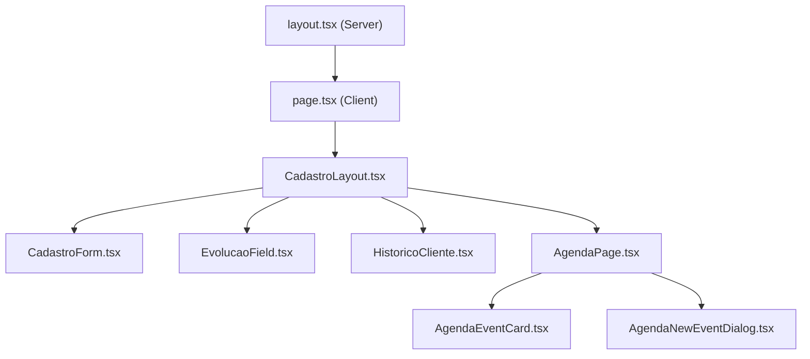

# 📋 Visão Geral do Projeto — Fisio

> **Sistema de Cadastro para Clínica de Fisioterapia**

---

## Stack Tecnológica

| Tecnologia | Uso |
|---|---|
| **Next.js 15 (App Router)** | Framework React com SSR/SSG e deploy na Vercel |
| **React 19 + TypeScript (TSX)** | Biblioteca principal de UI |
| **TailwindCSS v4** | Framework CSS utilitário (via PostCSS) |
| **shadcn/ui** | Componentes de UI (Button, Input, Card, Tabs, Select, Dialog, etc.) |
| **Lucide React** | Biblioteca de ícones |
| **Sonner** | Biblioteca de toasts/notificações |
| **Geist Sans** | Tipografia principal (via `next/font/google`) |

---

## Estrutura de Arquivos

```
Fisio/
├── next.config.ts          # Configuração Next.js
├── postcss.config.mjs      # PostCSS + TailwindCSS v4
├── tsconfig.json           # TypeScript config
├── package.json            # Dependências e scripts
├── src/
│   ├── app/
│   │   ├── layout.tsx      # Root Layout (metadata, font, Toaster)
│   │   ├── page.tsx        # Página principal ("use client")
│   │   └── globals.css     # Design Tokens (TailwindCSS)
│   ├── components/
│   │   ├── CadastroLayout.tsx  # Layout com abas (4 seções)
│   │   ├── CadastroForm.tsx    # Formulário de cadastro de pacientes
│   │   ├── EvolucaoField.tsx   # Campo de evolução clínica
│   │   ├── HistoricoCliente.tsx # Histórico do cliente
│   │   ├── AgendaPage.tsx      # Agenda estilo Google Calendar
│   │   ├── AgendaEventCard.tsx # Card de evento da agenda
│   │   ├── AgendaNewEventDialog.tsx # Modal de novo agendamento
│   │   ├── agendaTypes.ts      # Types do módulo Agenda
│   │   ├── agendaData.ts       # Dados e helpers do módulo Agenda
│   │   └── ui/                 # Componentes shadcn/ui
│   └── lib/
│       └── utils.ts            # Utilitário cn() (clsx + tailwind-merge)
└── docs/                       # 📂 Documentação detalhada
```

---

## Hierarquia de Componentes



---

## Paleta de Cores (Light Mode)

| Token | Valor OKLCH | Uso |
|---|---|---|
| `--primary` | `oklch(0.515 0.195 142.5)` | Cor principal (verde esmeralda) |
| `--background` | `oklch(1 0 0)` | Fundo da página (branco) |
| `--foreground` | `oklch(0.11 0.008 65)` | Texto principal (quase preto) |
| `--destructive` | `oklch(0.577 0.245 27.325)` | Ações destrutivas (vermelho) |
| `--border` | `oklch(0.92 0.004 286.32)` | Bordas sutis (cinza claro) |
| `--accent` | `oklch(0.515 0.195 142.5)` | Destaques (igual ao primary) |

---

## Design System: "Healthcare Minimal"

- **Cards** com bordas `border-slate-200` e `shadow-sm`
- **Botões principais** em `bg-emerald-600 hover:bg-emerald-700`
- **Labels** em `text-sm font-medium text-slate-700`
- **Tabs** com ícones Lucide + estado ativo em `bg-emerald-50 text-emerald-700`
- **Responsividade** via grid `grid-cols-1 md:grid-cols-2` e `md:grid-cols-3`
- **Tipografia** hierárquica: h1 `text-3xl font-bold`, h2 `text-lg font-semibold`, labels `text-sm`

---

## Deploy

- **Plataforma:** Vercel
- **Build command:** `next build`
- **Output:** `.next/` (gerado automaticamente)
- **Dev command:** `next dev` → `http://localhost:3000`

---

## Índice da Documentação

| # | Arquivo | Documentação |
|---|---|---|
| 1 | `layout.tsx` | [01_layout.md](./01_layout.md) |
| 2 | `globals.css` | [02_globals_css.md](./02_globals_css.md) |
| 3 | `page.tsx` | [03_page.md](./03_page.md) |
| 4 | `CadastroLayout.tsx` | [04_cadastro_layout.md](./04_cadastro_layout.md) |
| 5 | `CadastroForm.tsx` | [05_cadastro_form.md](./05_cadastro_form.md) |
| 6 | `EvolucaoField.tsx` | [06_evolucao_field.md](./06_evolucao_field.md) |
| 7 | `HistoricoCliente.tsx` | [07_historico_cliente.md](./07_historico_cliente.md) |
| 8 | `AgendaPage.tsx` | [08_agenda_page.md](./08_agenda_page.md) |
